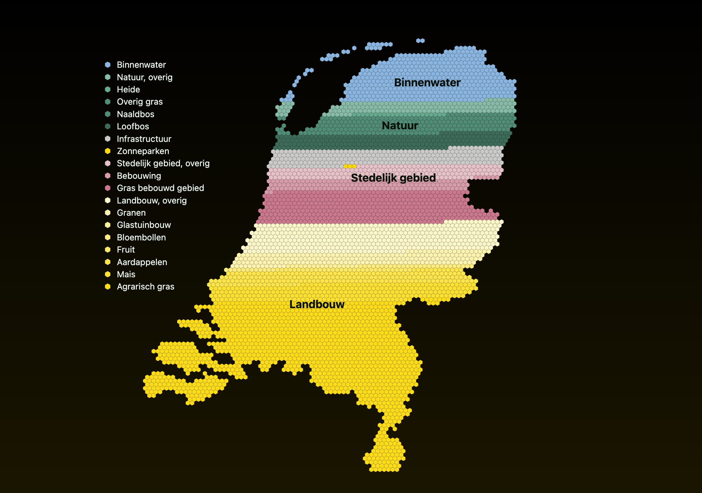

# Ons Land

I created a visualization to show how we use our land in the Netherlands. Much of our public discourse revolves around land use—housing crisis, sustainable farming, more solar energy? It's all about the land. Each hexagon represents 0.06% (26.647 hectares) of land of the Netherlands. The color of the hexagon indicates the type of land use.

You can find this visualization, how it was made, and the data sources on my website: https://koenvangilst.nl/labs/ons-land



## Development

Use the following commands to start the development server:

```bash
npx vite
```

This will create a webserver that automatically refreshes when you make changes to the code.

## TODOs

- [x] move index.html to public/index.html
- [x] use concentric areas for the hexagons (see branch feature/randstad/centric)
- [x] add hover state for hexagon categories
- [x] show percentage without cluttering the visualization
- [x] add source + credits
- [x] integrate in website
- [ ] write article

## Data sources

- [Agricultural land use](https://agrimatie.nl/ThemaResultaat.aspx?subpubID=2232&themaID=2286&indicatorID=2911#:~:text=Van%20het%20totaal%20areaal%20cultuurgrond,0%2C6%25%20voor%20glastuinbouw.&text=De%20basis%20voor%20de%20oppervlakte%20cultuurgrond%20is%20de%20Landbouwtelling.) (2022)
- [All land use](https://lgn.nl/reports/WENR-rapport%203235_Totaal_LR.pdf) (2021)
- [CBS Landtelling, agrarisch gebruik](https://www.cbs.nl/nl-nl/cijfers/detail/80780ned#shortTableDescription)
- Solar parks, according to [Kadaster](https://www.kadaster.nl/documents/d/kadaster.nl/kadaster-onderzoeksrapport-naar-zonneparken-in-nederland-1) (2023)
